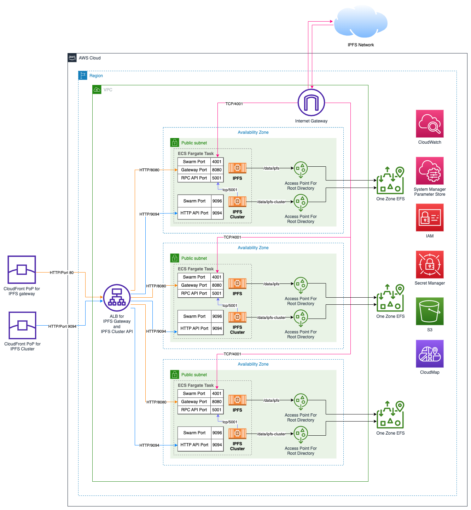
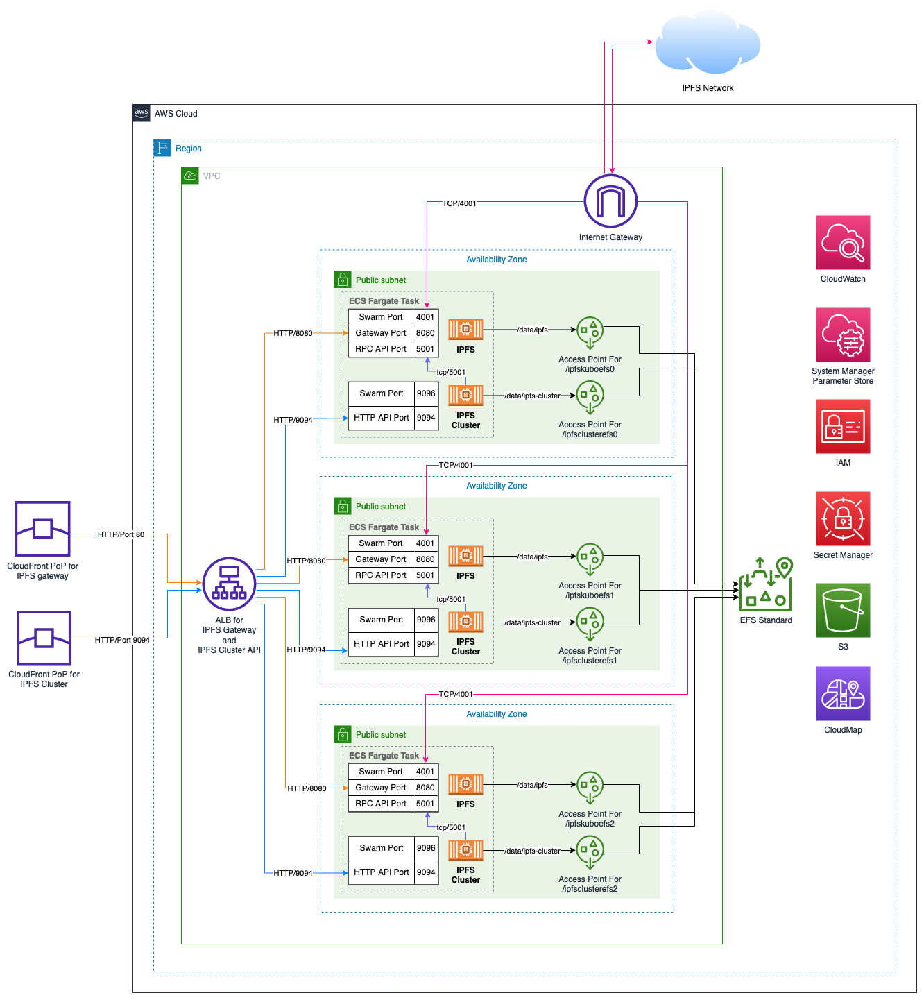

# Welcome to CDK Python project for IPFS Cluster on ECS Fargate!

A python CDK project to deploy IPFS Cluster on ECS Fargate. Pleare reference the [AWS Blog](https://aws.amazon.com/blogs/containers/deploying-ipfs-cluster-using-aws-fargate-and-amazon-efs-one-zone/) to deep dive the architect design.

## Architecture
### IPFS cluster with EFS One Zone Storage Class (Default)


### IPFS cluster with Standard EFS Storage
For the region contains AZ that does not support One Zone EFS.

Set `ONE_ZONE_EFS=False` in `ipfscluster.env`



## Prepare CDK Environment

The `cdk.json` file tells the CDK Toolkit how to execute your app.

This project is set up like a standard Python project.  The initialization
process also creates a virtualenv within this project, stored under the `.venv`
directory.  To create the virtualenv it assumes that there is a `python3`
(or `python` for Windows) executable in your path with access to the `venv`
package. If for any reason the automatic creation of the virtualenv fails,
you can create the virtualenv manually.

To manually create a virtualenv on MacOS and Linux:

```
$ python3 -m venv .venv
```

After the init process completes and the virtualenv is created, you can use the following
step to activate your virtualenv.

```
$ source .venv/bin/activate
```

If you are a Windows platform, you would activate the virtualenv like this:

```
% .venv\Scripts\activate.bat
```

Once the virtualenv is activated, you can install the required dependencies.

```
$ pip install -r requirements.txt
```

At this point you can now synthesize the CloudFormation template for this code.

```
$ cdk synth
```

To add additional dependencies, for example other CDK libraries, just add
them to your `setup.py` file and rerun the `pip install -r requirements.txt`
command.

### Useful commands

 * `cdk ls`          list all stacks in the app
 * `cdk synth`       emits the synthesized CloudFormation template
 * `cdk deploy`      deploy this stack to your default AWS account/region
 * `cdk diff`        compare deployed stack with current state
 * `cdk docs`        open CDK documentation

## Deploy the stack

### Configure the EFS storage 

Set `ONE_ZONE_EFS` to `True` in `ipfscluster.env` will deploy EFS one zone file system and access poinbt on each AZ

Set `ONE_ZONE_EFS` to `False` in `ipfscluster.env` will deploy EFS   file system cross AZs. EFS access point will be created on each AZ.

Set `EFS_REMOVE_ON_DELETE` to `True` in `ipfscluster.env` will **DELETE** the EFS file system while destroying the CDK stack. The defulat behavior is **RETAIN** the EFS file system.

Set `ECS_EXEC` to `True` in `ipfscluster.env` will **ENABLE** [ECS EXEC](https://docs.aws.amazon.com/AmazonECS/latest/developerguide/ecs-exec.html) Command for debugging purpose.

### Prepare IPFS Cluster Related Parameter
__DUE TO SECRET CONCERN__,  parameter will be stored in **Secret Manager** and will not showed up on Cloudformation console and only default value will show up in template. However, you need those paramters to inovke IPFS Cluster API. Plase taking a note on those parameter and keep it safe.

1. Download [ipfs-cluster-service](https://dist.ipfs.tech/#ipfs-cluster-service)
2. Execute following command and find `id` and `private_key` in `identity.json`. Find `secret` in `service.json`
```
./ipfs-cluster-service -c /tmp/ipfs init 
```


## Sample CDK Deploy Command

Export `CDK_DEPLOY_REGION` variable can specify region other than default CDK region for the deployment.

```
export CDK_DEPLOY_REGION=ap-northeast-3; cdk deploy \
--parameters ClusterId=12D3KooWRjwfEtpPmnnjkUbwv4mWtWoUdmKemcqwfLNFGPV3P8PC \
--parameters ClusterSecret=221813dc706c2d1baaf0a15a8710e3c5e2072783c49d214243540044f21a7315 \
--parameters ClusterPrivateKey=CAESQGM5s/BsNF06WZ6Kzn4uAnPGsgXo6Ir3hmcW981bo8v57Jj0nPJGTB86m95dygxailhiWgVEB0qf+N8Nd7ozaxM= \
--parameters ClusterCredential=admin:p@ssw0rd
```

Output
```
Outputs:
IpfsClusterFargateStack.IpfsClusterEndpoint = dg2xxxxxxxxxx.cloudfront.net
IpfsClusterFargateStack.IpfsGatewayEndpoint = d2xxxxxxxxxxx.cloudfront.net
```


### List all IPFS peers

Download [ipfs-cluster-ctl]( https://dist.ipfs.tech/#ipfs-cluster-ctl)
Get $IpfsClusterEndpoint from CDK output.

```
export REST_API_DNS_ENDPOINT=$IpfsClusterEndpoint
export SECRET=221813dc706c2d1baaf0a15a8710e3c5e2072783c49d214243540044f21a7315
export CLUSTER_RESTAPI_BASICAUTHCREDENTIALS=admin:p@ssw0rd
./ipfs-cluster-ctl -l /dns/${REST_API_DNS_ENDPOINT}/tcp/443 \
--secret ${CLUSTER_SECRET} \
--basic-auth ${CLUSTER_RESTAPI_BASICAUTHCREDENTIALS} peers ls
```
Example Output:
```
12D3KooWRjwfEtpPmnnjkUbwv4mWtWoUdmKemcqwfLNFGPV3P8PC | IpfsCluster0 | Sees 2 other peers
  > Addresses:
    - /ip4/10.0.0.71/tcp/9096/p2p/12D3KooWRjwfEtpPmnnjkUbwv4mWtWoUdmKemcqwfLNFGPV3P8PC
    - /ip4/127.0.0.1/tcp/9096/p2p/12D3KooWRjwfEtpPmnnjkUbwv4mWtWoUdmKemcqwfLNFGPV3P8PC
  > IPFS: 12D3KooWRpU1e9Q7hgowMiZDjpK4xvh2jXEXRuRBud9XYGetTniK
  ...
12D3KooWH7w2NDcZWxnS885rZgaPz65NAXhv45JkMLdK1x5aJi2C | IpfsCluster1 | Sees 2 other peers
  > Addresses:
    - /ip4/10.0.2.66/tcp/9096/p2p/12D3KooWH7w2NDcZWxnS885rZgaPz65NAXhv45JkMLdK1x5aJi2C
    - /ip4/127.0.0.1/tcp/9096/p2p/12D3KooWH7w2NDcZWxnS885rZgaPz65NAXhv45JkMLdK1x5aJi2C
  > IPFS: 12D3KooWGyUcYasEGvbvPHgoGcfgxnTqT9Syg7dkW9BWWxkcbcpT
  ...
12D3KooWBhEzKxgj5CMSriTXPXtjdpkoXxuHZAJvZ77NAQqNijXW | IpfsCluster2 | Sees 2 other peers
  > Addresses:
    - /ip4/10.0.1.104/tcp/9096/p2p/12D3KooWBhEzKxgj5CMSriTXPXtjdpkoXxuHZAJvZ77NAQqNijXW
    - /ip4/127.0.0.1/tcp/9096/p2p/12D3KooWBhEzKxgj5CMSriTXPXtjdpkoXxuHZAJvZ77NAQqNijXW
  > IPFS: 12D3KooWFFRMoufVPwMoX6JiNu1wJ9yYm971kRYK16af2QLZkdsN
  ...
```

### Add a file to the IPFS cluster
```
./ipfs-cluster-ctl -l /dns/${REST_API_DNS_ENDPOINT}/tcp/443 \
--secret ${CLUSTER_SECRET} \
--basic-auth ${CLUSTER_RESTAPI_BASICAUTHCREDENTIALS} add $PATH_TO_FILE
```
Output
```
added Qmc9CzkoBMoPGXt78mGcE9SAXcTnvttR8UNNXXXXXXXXXX $FILENAME
```

### Get the IPFS file via public gateway
```
curl https://ipfs.io/ipfs/$CID --output $PATH_TO_SAVE
```

### Get the IPFS file via IPFS Cluster gateway (Cloudfront Distribution)
Get $IpfsGatewayEndpoint from CDK output
```
curl https://$IpfsGatewayEndpoint/ipfs/$CID --output $PATH_TO_SAVE
```

Enjoy!
